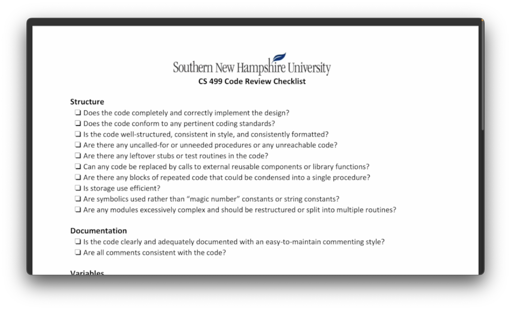
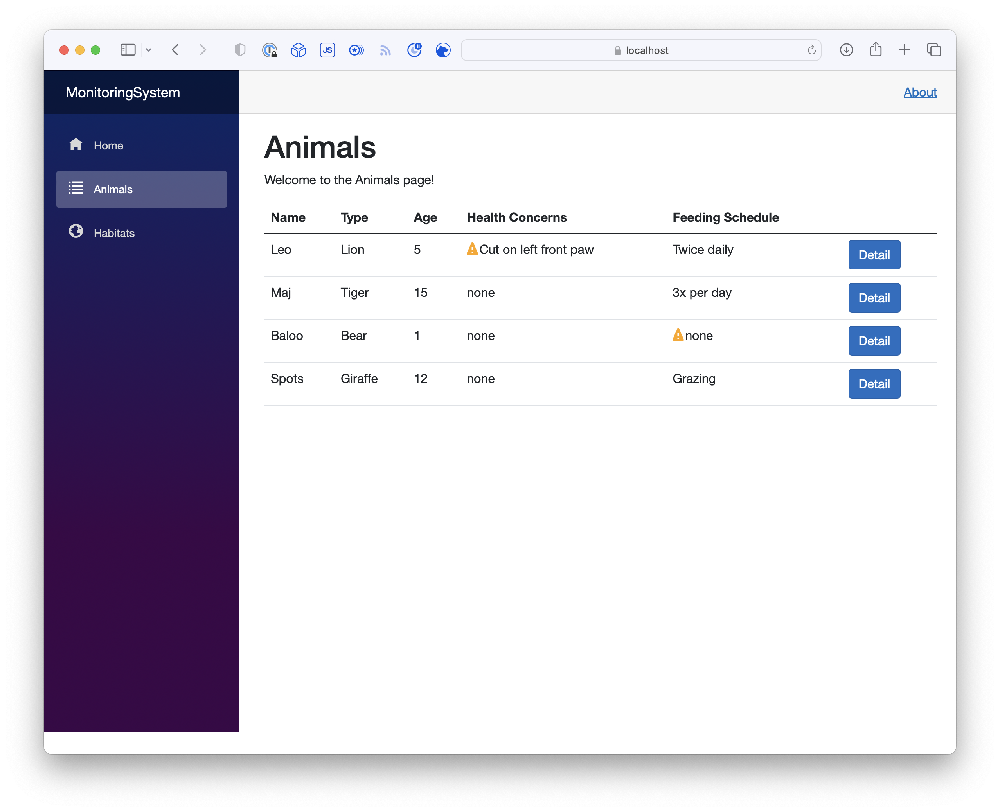
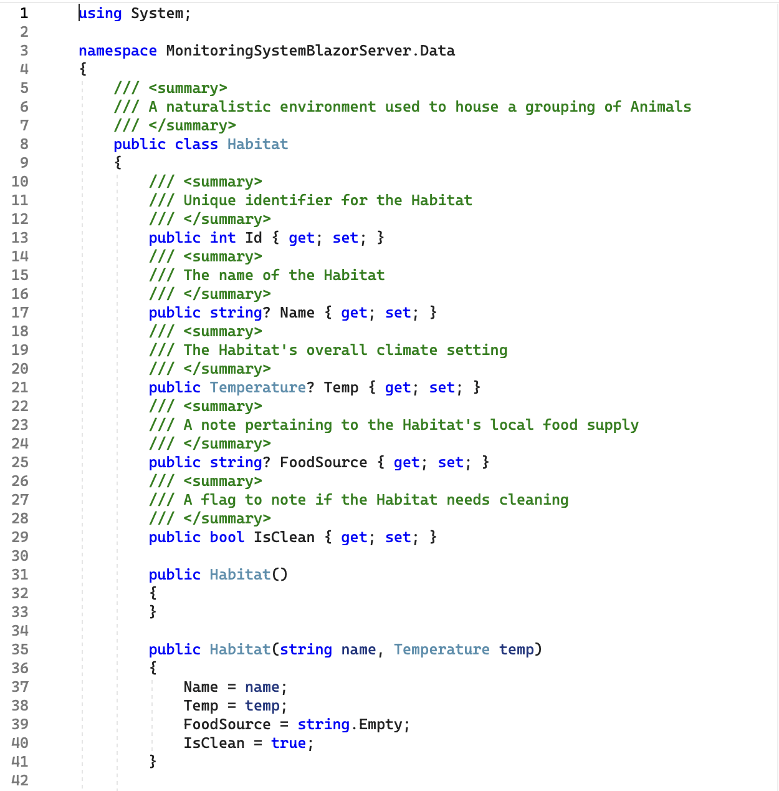
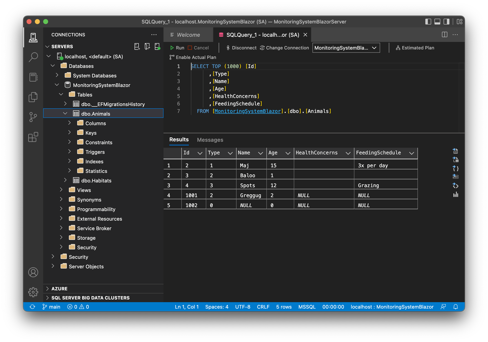

# CS-499 Computer Science Capstone Project

## Introduction

This electronic portfolio (ePortfolio) symbolizes the culmination of my time at Southern New Hampshire University's Computer Science program. Each section represents a combination of knowledge and skill I have learned during my time in the program. It includes an informal code review, followed by a single artifact that illustrates growth in three key categories of Computer Science: Software Design and Engineering, Algorithms and Data Structures, and Databases.

### Table of Contents
1. [Professional Self Assessment](#assessment)
2. [Code Review](#review)
3. [Software Design and Engineering Artifact](#artifact-one)
4. [Algorithms and Data Structures Artifact](#artifact-two)
5. [Databases Artifact](#artifact-three)
6. [Artifact Download Link](#download)

### 1. Professional Self Assessment <a name="assessment" />
My experience throughout the SNHU Computer Science program has been an incredible journey. When I started, I knew a little about programming applications to make them behave differently, but I lacked a strong understanding of the context behind those changes. At the end of my time with the CS program, I have a much deeper appreciation for the world of Software Engineering, how far it has come from the early days of computing, and what is possible in the future.

Throughout the program, I learned that my strengths include the following:

- Thinking about user needs and requirements.
- Enforcing stakeholder business rules.
- Providing robust technical solutions to actual and potential problems.
Examples of these experiences include the CS 340 Client/Server Development work, which addresses a customer's need to develop a functioning dashboard application. Another example is analyzing an SQL database to prepare a business report as part of DAD-220 Structured Database Environments. 

My focus and passion in Software Engineering stem from wanting to provide greater tooling to users, whether they are internal stakeholders of a company or external-facing customers. I am a firm believer in using a robust software architecture with efficient design, data structures, and algorithms to collaborate with others to solve practical problems and make others' day-to-day lives more manageable. I also believe in the importance of proper security standards to meet these goals by following secure coding practices and performing detailed code reviews. 

There are five key outcomes for this project, which are as follows:

- I employed heavy planning and a code review process that encourages collaboration and iteration with a peer's work and supports the idea of making changes at either an individual or organizational level by discussing the code's high and low-level ramifications.
- I designed and developed professional-quality communication work via lengthy code documentation and a code review analysis to highlight the quality differences between the original and final artifacts.
- I designed and evaluated solutions to solve the problem of how to modernize a simple Java problem into a complex web-based solution that both utilizes traditional CS practices and involves an industry-standard set of design patterns and challenges.
- I demonstrated numerous industry-standard skills and techniques to build a web application with forms, establish a library of shared data objects and unit tests, and develop an API that interfaces with the application.
- Throughout this process, I developed a security mindset by highlighting all the security flaws with the original artifact, proposing changes that would eliminate those vulnerabilities, and replacing them with more secure designs such as a working database and API server, as well as form and model validation.

The following artifact enhancements demonstrate my abilities in many of these critical topics and how they fit with my program experiences. In addition, it describes the journey of taking an artifact from my early years in the program and how I could turn it into a working, full-stack application.

### 2. Code Review <a name="review" />

Click the image below to watch:

Original Artifact Link - [MonitoringSystem.zip](https://github.com/cclayton02/cclayton02.github.io/tree/main/assets/zip/MonitoringSystem.zip)

This video presentation reflects a code analysis process for my selected artifact, an Animal Monitoring System created as part of the final project for the course IT-145 Foundation in App Development. It is a console-based application written using the Java programming language. This presentation walks through the application's existing functionality, analyzes the code's structure based on checklist items, and discusses potential enhancements that will satisfy the course outcomes.

### 3. Software Design and Engineering Enhancement <a name="artifact-one" />

#### Convert to Blazor Web Application

_Description_

The first artifact represents a standalone web application that takes the original Animal Monitoring System code in Java and ports the functionality to a Blazor Application written using a combination of HTML/CSS and C#. I created the initial application to demonstrate my Software Engineering and Design skills and create a platform for other enhancements to build off. Creating a new Blazor application was not challenging, but I had to make several changes to prepare for future changes. At this stage, I learned the importance of planning and its downstream impact on any current or future enhancement work.

_List of Enhancements Performed:_

* Transfer code/data from the original Java application to a C# web application
* Create a working application that will support other enhancements
* New version of the application still satisfies the original project requirements
* Ability to switch between Animal/Habitat display
* Detailed information panel for each grouping
* Displays an alert warning, if one is present

This artifact enhancement demonstrates an ability to use the SDLC to iteratively take the components from one version of an application into another and ensure each piece works as expected before moving on to the next component. I performed careful planning and analysis in the early stages with proposed documentation and code review. I used this stage to focus on the design and efficient implementation of the new application using industry-standard best practices such as model-view-controller (MVC). I also prepared the project to be maintainable using heavily-documented code with headers.

### 4. Algorithms and Data Structures Enhancement <a name="artifact-two" />

#### Class Abstraction and Unit Tests

_Description_

This artifact represents enhancements to the Animal Monitoring System Web Application's Data Structures and Algorithms by building off the previous enhancement work and replacing the original DataFile class and methods with a more object-oriented design. The use of objects allows the ability to validate data structures via Unit Tests and sets up additional work for interaction with a database module. In addition, this artifact taught me the importance of concepts such as a "shared" library that more than one project or application will want to utilize. Finally, it helps to promote consistency and reduce the overall amount of required code.

_List of Enhancements Performed:_

* Replaced DataFile class with more intuitive abstractions for Animals/Habitats, including Models and Services
* Used abstractions to pull and display monitoring information efficiently.
* Validated new data structures with Unit Tests
* Included exception handling to address data errors/missing data
* Prepared for future database work through the use of mock data

The skills and outcomes demonstrated by the work performed at this stage include a focus on security by reducing the number of bugs and security vulnerabilities present in the original program by rewriting unoptimized code to feature more abstractions. In addition, I promoted explicit data validation via unit tests and ensured that the new models / services satisfied the original data requirements. Finally, I have created robust and future-proof data structures / components to support the ability to develop other systems or models, if needed, at a future date. This enhancement resolves many fundamental design flaws in the original software's simple architecture and replaces them with more versatile and atomic structures.

### 5. Databases Enhancement <a name="artifact-three" />

#### SQL Server Interface

_Description_

The final enhancement for this artifact replaces the text-based data input from the original artifact with an additional program to support the Animal Monitoring System in the form of a database module that uses APIs to pass data from a SQL Server to the Blazor Application and vice versa. It completes the final issue with the original artifact's design by replacing plain text data files with a database that the application can use to interact. This enhancement was by far the most challenging component for me to develop, but extremely rewarding once it was in place. It gives me a greater appreciation for the complex relationship between a modern database and a web application.

_List of Enhancements Performed:_
* Developed a new Server Application that uses REST API
* API serves as a module for Applications to perform CRUD operations
* Created a running SQL database to service the API Server
* Built new forms to support CRUD functions for the Blazor Application

This enhancement demonstrates the ability to create a working database with authentication that bypasses flaws in the security of the original program's design. It incorporates working CRUD operations into the Web Application and includes some final steps for iteration. I have also validated my architectural design for the Web Application by handling and validating data through an API server. As part of the SQL server creation, I used industry-standard solutions such as Docker to get the database to interoperate easily with the REST API and Web Application. 

### 6. Final Project - Artifact Download Link <a name="download" />

[GitHub Page - MonitoringSystemBlazorServer](https://github.com/cclayton02/MonitoringSystemBlazorServer)

[MonitoringSystemBlazorServer.zip](https://github.com/cclayton02/cclayton02.github.io/tree/main/assets/zip/MonitoringSystemBlazorServer.zip)
